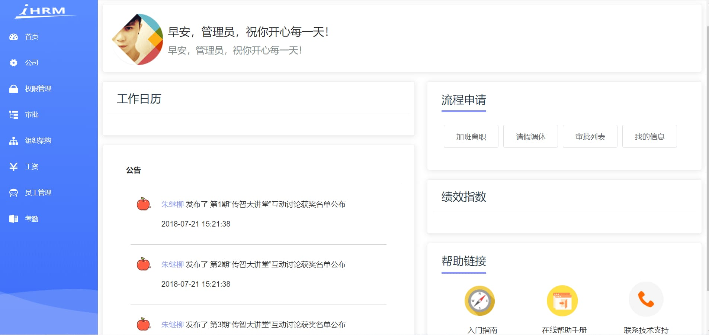
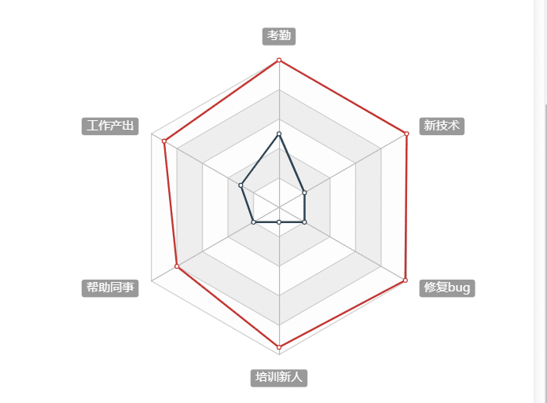
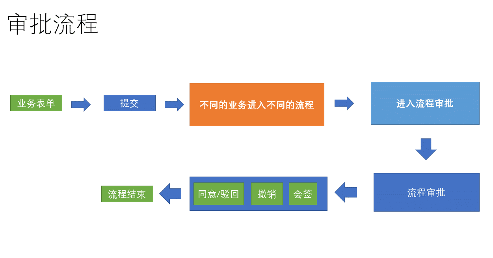

## 首页的页面结构

**`目标`**： 实现系统首页的页面结构

> 目前，我们的页面还剩下首页，这里我们可以按照如图实现一下的结构


首页页面结构，**src/views/dashboard/index.vue**

```vue
<template>
  <div class="dashboard-container">
    <!-- 头部内容 -->
    <el-card class="header-card">
      <div>
        <div class="fl headL">
          <div class="headImg">
            
          </div>
          <div class="headInfoTip">
            <p class="firstChild">早安，管理员，祝你开心每一天！</p>
            <p class="lastChild">早安，管理员，祝你开心每一天！</p>
          </div>
        </div>
        <div class="fr" />
      </div>
    </el-card>
    <!-- 主要内容 -->
    <el-row type="flex" justify="space-between">
      <!-- 左侧内容 -->
      <el-col :span="13" style="padding-right:26px">
        <!-- 工作日历 -->
        <el-card class="box-card">
          <div slot="header" class="header">
            <span>工作日历</span>
          </div>
        <!-- 放置日历组件 -->
        </el-card>
        <!-- 公告 -->
        <el-card class="box-card">
          <div class="advContent">
            <div class="title"> 公告</div>
            <div class="contentItem">
              <ul class="noticeList">
                <li>
                  <div class="item">
                    
                    <div>
                      <p><span class="col">朱继柳</span> 发布了 第1期“传智大讲堂”互动讨论获奖名单公布</p>
                      <p>2018-07-21 15:21:38</p>
                    </div>
                  </div>
                </li>
                <li>
                  <div class="item">
                    
                    <div>
                      <p><span class="col">朱继柳</span> 发布了 第2期“传智大讲堂”互动讨论获奖名单公布</p>
                      <p>2018-07-21 15:21:38</p>
                    </div>
                  </div>
                </li>
                <li>
                  <div class="item">
                    
                    <div>
                      <p><span class="col">朱继柳</span> 发布了 第3期“传智大讲堂”互动讨论获奖名单公布</p>
                      <p>2018-07-21 15:21:38</p>
                    </div>
                  </div>
                </li>
              </ul>
            </div>
          </div>
        </el-card>
      </el-col>
      <!-- 右侧内容 -->
      <el-col :span="11">
        <el-card class="box-card">
          <div class="header headTit">
            <span>流程申请</span>
          </div>
          <div class="sideNav">
            <el-button class="sideBtn">加班离职</el-button>
            <el-button class="sideBtn">请假调休</el-button>
            <el-button class="sideBtn">审批列表</el-button>
            <el-button class="sideBtn">我的信息</el-button>
          </div>
        </el-card>

        <!-- 绩效指数 -->
        <el-card class="box-card">
          <div slot="header" class="header">
            <span>绩效指数</span>
          </div>
        <!-- 放置雷达图 -->
        </el-card>
        <!-- 帮助连接 -->
        <el-card class="box-card">
          <div class="header headTit">
            <span>帮助链接</span>
          </div>
          <div class="sideLink">
            <el-row>
              <el-col :span="8">
                <a href="#">
                  <span class="icon iconGuide" />
                  <p>入门指南</p>
                </a>
              </el-col>
              <el-col :span="8">
                <a href="#">
                  <span class="icon iconHelp" />
                  <p>在线帮助手册</p>
                </a>
              </el-col>
              <el-col :span="8">
                <a href="#">
                  <span class="icon iconTechnology" />
                  <p>联系技术支持</p>
                </a>
              </el-col>
            </el-row>
          </div>
        </el-card>
      </el-col>
    </el-row>
  </div>
</template>

<script>
import { mapGetters } from 'vuex'

export default {
  name: 'Dashboard',
  computed: {
    ...mapGetters([
      'name'
    ])
  }
}
</script>

<style lang="scss" scoped>
.dashboard-container {
  margin: 10px;
  li {
    list-style: none;
  }
  .headImg {
    float: left;
    width: 100px;
    height: 100px;
    border-radius: 50%;
    background: #999;
          img {
      width: 100%;
      height: 100%;
      border-radius: 50%;
    }
  }

  .headInfoTip {
    padding: 25px 0 0;
    margin-left: 120px;
    p {
      padding: 0 0 15px;
      margin: 0;
      &.firstChild {
        font-size: 24px;
      }
      &.lastChild {
        font-size: 20px;
        color: #7f8c8d;
      }
    }
  }
}

.box-card {
  padding: 5px 10px;
  margin-top: 20px;
  .header {
    span {
      color: #2c3e50;
      font-size: 24px;
    }
    .item {
      color: #97a8be;
      float: right;
      padding: 3px 0;
    }
  }
  .headTit {
    span {
      border-bottom: 4px solid #8a97f8;
      padding-bottom: 10px;
    }
  }
}
.header-card{
  position: relative;
  .header {
    position: absolute;
    right: 20px;
    top: 15px;
    z-index: 1;
  }
}

.advContent {
  background: #fff;
  border-radius: 5px 5px 0px 0px;
  .title {
    font-size: 16px;
    padding: 20px;
    font-weight: bold;
    border-bottom: solid 1px #ccc;
  }
  .contentItem {
    padding: 0 30px;
    min-height: 350px;
    .item {
      display: flex;
      padding:18px 0 10px;
      border-bottom: solid 1px #ccc;
      .col {
        color: #8a97f8;
      }
      img {
        width: 56px;
        height: 56px;
        border-radius: 50%;
        margin-right: 10px;
      }
      p{
        padding: 0 0 8px;
      }
    }
  }
}
.noticeList {
  margin: 0;
  padding: 0;
}
.sideNav,
.sideLink {
  padding: 30px 0 12px;
  .sideBtn {
    padding: 16px 26px;
    font-size:16px;
    margin: 10px 5px;
  }
}
.sideLink {
  text-align: center;
  .icon {
    display: inline-block;
    width: 76px;
    height: 76px;
    background: url('./../../assets/common/icon.png') no-repeat;
  }
  .iconGuide {
    background-position: 0 0;
  }
  .iconHelp {
    background-position: -224px 0;
  }
  .iconTechnology {
    background-position: -460px 0;
  }
}
</style>

```

> 通过上面的代码，我们得到了如下的页面



大家发现，我们预留了**`工作日历`**和**`绩效指数`**两个组件，我们会在后续的组件中进行开发

**提交代码**

## 首页用户资料显示

​	**`目标`**：将首页的信息换成真实的用户资料

> 直接获取Vuex的用户资料即可

```vue
<script>
import { createNamespacedHelpers } from 'vuex'
const { mapState } = createNamespacedHelpers('user')
export default {
  name: 'Dashboard',
  data() {
    return {
      defaultImg: require('@/assets/common/head.jpg'),
    }
  },
  computed: {
    ...mapState(['userInfo'])
  }
}
</script>
```

在 vue视图中绑定

```vue
<div class="fl headL">
          <div class="headImg">
            
          </div>
          <div class="headInfoTip">
            <p class="firstChild">早安，{{ userInfo.username }}，祝你开心每一天！</p>
            <p class="lastChild">{{ userInfo.username }}   |  {{ userInfo.companyName }}-{{ userInfo.departmentName }}</p>
          </div>
        </div>
```

> 除此之外，当我们加载图片失败的时候，图片地址存在，但是却不能显示，之前我们封装的图片错误指令可以应用

```vue

```

## 工作日历组件封装

**`目标`**封装一个工作日历组件在首页中展示

### 新建工作日历组件结构

>  工作日历的要求很简单，显示每个月的日期，可以设定日期的范围

我们可以基于Element组件[el-calendar](https://element.eleme.cn/#/zh-CN/component/calendar)进行封装

代码如下  **`src/views/dashboard/components/work-calendar.vue`**

```vue
<template>
  <div>
    <el-row type="flex" justify="end">
      <el-select v-model="currentYear" size="small" style="width: 120px" @change="dateChange">
        <el-option v-for="item in yearList" :key="item" :label="item" :value="item">{{ item }}</el-option>
      </el-select>
      <el-select v-model="currentMonth" size="small" style="width: 120px;margin-left:10px" @change="dateChange">
        <el-option v-for="item in 12" :key="item" :label="item" :value="item">{{ item }}</el-option>
      </el-select>
    </el-row>
    <el-calendar v-model="currentDate">
      <template v-slot:dateCell="{ date, data }" class="content">
        <div class="date-content">
          <span class="text"> {{ data.day | getDay }}</span>
          <span v-if="isWeek(date)" class="rest">休</span>
        </div> 
      </template>
    </el-calendar>
  </div>
</template>

<script>
export default {
  filters: {
    getDay(oldVal) {}
  },
  data() {
    const currentDate = new Date()
    const currentMonth = currentDate.getMonth() + 1
    const currentYear = currentDate.getFullYear()
    const yearList = []
    
    return {
      currentDate,
      currentMonth,
      currentYear,
      yearList
    }
  },
  methods: {
    dateChange() {},
    isWeek(date) {}
  }
}
</script>

<style  scoped>
 /deep/ .el-calendar-day {
  height:  auto;
 }
 /deep/ .el-calendar-table__row td,/deep/ .el-calendar-table tr td:first-child,  /deep/ .el-calendar-table__row td.prev{
  border:none;
 }
.date-content {
  height: 40px;
  text-align: center;
  line-height: 40px;
  font-size: 14px;
}
.date-content .rest {
  color: #fff;
  border-radius: 50%;
  background: rgb(250, 124, 77);
  width: 20px;
  height: 20px;
  line-height: 20px;
  display: inline-block;
  font-size: 12px;
  margin-left: 10px;
}
.date-content .text{
  width: 20px;
  height: 20px;
  line-height: 20px;
 display: inline-block;

}
 /deep/ .el-calendar-table td.is-selected .text{
   background: #409eff;
   color: #fff;
   border-radius: 50%;
 }
 /deep/ .el-calendar__header {
   display: none
 }
</style>

```

### 实现工作日历逻辑

```js
export default {
  filters: {
    getDay(oldVal) {
      return oldVal.split('-')[2]
    }
  },
  data() {
    const currentDate = new Date()
    const currentMonth = currentDate.getMonth() + 1
    const currentYear = currentDate.getFullYear()
    const yearList = []
    for (let i = 0; i < 11; i++) {
      yearList.push(currentYear - 5 + i)
    }
    console.log(yearList)
    return {
      currentDate,
      currentMonth,
      currentYear,
      yearList
    }
  },
  methods: {
    dateChange() {
      // 重新计算 currentDate 触发日历更新即可
      this.currentDate = new Date(`${this.currentYear}-${this.currentMonth}`)
    },
    isWeek(date) {
      // 根据传入的日期是否为周末, 返回 true / false
      return date.getDay() === 6 || date.getDay() === 0
    }
  }
}
```

**在主页中应用**

```vue
  <!-- 放置日历组件 -->
  <work-calendar />
```


**提交代码**

## 封装雷达图图表显示在首页

**`目标`**：封装一个echarts中的雷达图表显示在首页的绩效指数的位置

### 了解雷达图

### 封装雷达图插件

> 首页中，还有一个绩效指数的位置需要放置一个雷达图的图表，我们可以采用百度的echarts进行封装

第一步， 安装echarts图表

```bash
$ npm i echarts
```

> echarts是一个很大的包，里面包含了众多图形，假设我们只使用雷达图，可以做按需加载

第二步， 新建雷达图组件，**`src/views/dashboard/components/radar.vue`**

```vue
<template>
  <div>
    <div ref="myChart" style="height: 400px;" />
  </div>
</template>

<script>
// 引入库
// import * as echarts from 'echarts'
import * as echarts from 'echarts/core'
import { RadarChart } from 'echarts/charts'
import { CanvasRenderer } from 'echarts/renderers'

echarts.use([RadarChart, CanvasRenderer])

export default {
  mounted() {
    // 初始化示例
    const myChart = echarts.init(this.$refs.myChart)
    // 绘制图表
    const option = {
      textStyle: {
        fontSize: 16
      },
      radar: {
        // shape: 'circle',
        indicator: [
          { name: 'Sales', max: 6500 },
          { name: 'Administration', max: 16000 },
          { name: 'Information Technology', max: 30000 },
          { name: 'Customer Support', max: 38000 },
          { name: 'Development', max: 52000 },
          { name: 'Marketing', max: 25000 }
        ]
      },
      series: [
        {
          name: 'Budget vs spending',
          type: 'radar',
          data: [
            {
              value: [4200, 3000, 20000, 35000, 50000, 18000],
              name: 'Allocated Budget'
            },
            {
              value: [5000, 14000, 28000, 26000, 42000, 21000],
              name: 'Actual Spending'
            }
          ]
        }
      ]
    }

    myChart.setOption(option)
  }
}
</script>

<style>

</style>

```

我们得到一个雷达图，对绩效指数进行统计



**`注意`**：相关数据的缺失，所以这里我们进行的是模拟数据

**在主页中引入使用**

```vue
import Radar from './components/radar'

```

## 审批流程业务的基本介绍

> 什么是审批流程



## 提交一个离职审批 (课后)

**`目标`**： 提交一个离职的审批，并完成业务流转

**离职弹层**

```vue
    <!-- 弹出层 -->
    <el-dialog :visible="showDialog" title="离职申请" @close="btnCancel">
      <el-form
        ref="ruleForm"
        :model="ruleForm"
        status-icon
        label-width="110px"
        :rules="rules"
      >
        <!--离职表单-->
        <el-form-item label="离职时间" prop="end_time">
          <el-date-picker
            v-model="ruleForm.exceptTime"
            type="datetime"
            value-format="yyyy-MM-dd HH:mm:ss"
            placeholder="选择日期时间"
          />
        </el-form-item>
        <el-form-item label="离职原因" prop="reason">
          <el-input
            v-model="ruleForm.reason"
            type="textarea"
            :autosize="{ minRows: 3, maxRows: 8}"
            style="width: 70%;"
            placeholder="请输入内容"
          />
        </el-form-item>
      </el-form>
      <el-row slot="footer" type="flex" justify="center">
        <el-col :span="6">
          <el-button size="small" type="primary" @click="btnOK">确定</el-button>
          <el-button size="small" @click="btnCancel">取消</el-button>
        </el-col>
      </el-row>
    </el-dialog>
```

**显示弹层**

```vue
<el-button class="sideBtn" @click="showDialog = true">加班离职</el-button>
```

**加班数据及校验**

```js
      showDialog: false,
      ruleForm: {
        exceptTime: '',
        reason: '',
        processKey: 'process_dimission', // 特定的审批
        processName: '离职'
      },
      rules: {
        exceptTime: [{ required: true, message: '离职时间不能为空' }],
        reason: [{ required: true, message: '离职原因不能为空' }]
      }
```

**提交审批逻辑**

```js
import { startProcess } from '@/api/approvals'
  
methods: {
    btnOK() {
      this.$refs.ruleForm.validate(async validate => {
        if (validate) {
          // 注意这里需要一个 userId, 也可以参考示例网站的使用方法
          const data = { ...this.ruleForm, userId: this.userInfo.userId }
          await startProcess(data)
          this.$message.success('提交流程成功')
          this.btnCancel()
        }
      })
    },
    btnCancel() {
      this.showDialog = false
      this.$refs.ruleForm.resetFields()
      this.ruleForm = {
        exceptTime: '',
        reason: '',
        processKey: 'process_dimission', // 特定的审批
        processName: '离职'
      }
    }
  }
```

注意： 审批接口中的同意接口存在一定问题，如果线上的示例也无法发送的话, 本地开发仅测试请求发出就好

**`提交代码`**