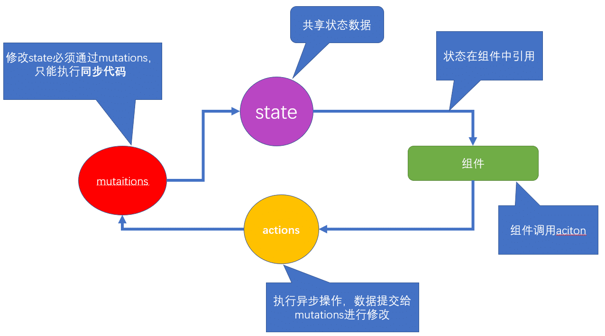
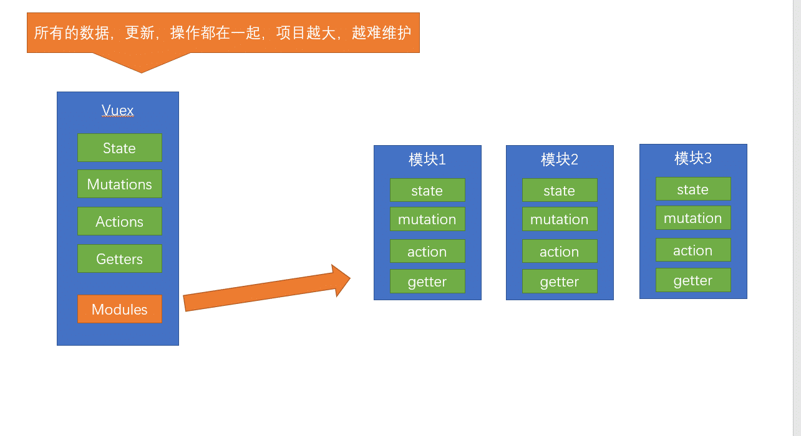
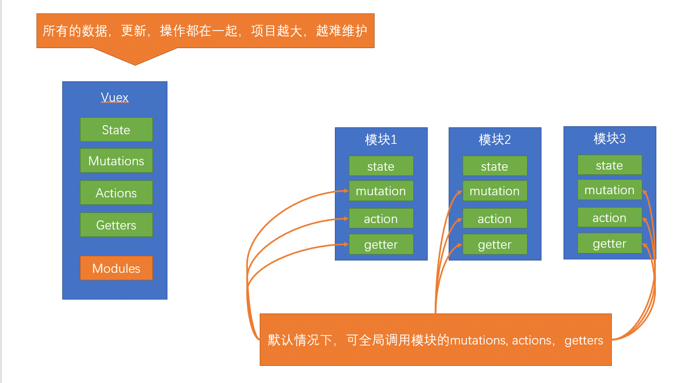

## vuex基础-介绍

>  为什么会有Vuex ?

​	Vuex 是一个专为 Vue.js 应用程序开发的**状态管理模式**。它采用**`集中式`**存储管理应用的所有组件的状态，并以相应的规则保证状态以一种**`可预测`**的方式发生变化。

- vuex是采用集中式管理组件依赖的共享数据的一个工具，可以解决不同组件数据共享问题。



**结论**

1. 修改state状态必须通过**`mutations`**
2. **`mutations`**只能执行同步代码，类似ajax，定时器之类的代码不能在mutations中执行
3. 执行异步代码，要通过actions，然后将数据提交给mutations才可以完成
4. state的状态即共享数据可以在组件中引用
5. 组件中可以调用action

## vuex基础-初始化功能

> 建立一个新的脚手架项目, 在项目中应用vuex

```bash
$ vue create  demo
```

> 开始vuex的初始化建立，选择模式时，选择默认模式

初始化：

- 第一步：`npm i vuex --save`  => 安装到**`运行时依赖`**   => 项目上线之后依然使用的依赖 ,开发时依赖  => 开发调试时使用  

> 开发时依赖 就是开开发的时候，需要的依赖，运行时依赖，项目上线运行时依然需要的

- 第二步： **在main.js中** `import Vuex from 'vuex'`
- 第三步：**在main.js中**  `Vue.use(Vuex)`  => 调用了 vuex中的 一个install方法
- 第四步：`const store = new Vuex.Store({...配置项})`
- 第五步：在根实例配置 store 选项指向 store 实例对象

```js
import Vue from 'vue'
import Vuex from 'vuex'
Vue.use(vuex)
const store = new Vuex.Store({})
new Vue({
  el: '#app',
  store
})
```

## vuex基础-state

state是放置所有公共状态的属性，如果你有一个公共状态数据 ， 你只需要定义在 state对象中

**定义state**

```js
// 初始化vuex对象
const store = new Vuex.Store({
  state: {
    // 管理数据
    count: 0
  }
})
```

> 如何在组件中获取count?

**原始形式**- 插值表达式

**`App.vue`**

组件中可以使用  **this.$store** 获取到vuex中的store对象实例，可通过**state**属性属性获取**count**， 如下

```vue
<div> state的数据：{{ $store.state.count }}</div>
```

**计算属性** - 将state属性定义在计算属性中

```js
// 把state中数据，定义在组件内的计算属性中
  computed: {
    count () {
      return this.$store.state.count
    }
  }
```

```vue
 <div> state的数据：{{ count }}</div>
```

**辅助函数**  - mapState

>mapState是辅助函数，帮助我们把store中的数据映射到 组件的计算属性中, 它属于一种方便用法

用法 ： 第一步：导入mapState

```js
import { mapState } from 'vuex'
```

第二步：采用数组形式引入state属性

```js
mapState(['count']) 
```

> 上面代码的最终得到的是 **类似**

```js
count () {
    return this.$store.state.count
}
```

第三步：利用**延展运算符**将导出的状态映射给计算属性

```js
  computed: {
    ...mapState(['count'])
  }
```

```vue
 <div> state的数据：{{ count }}</div>
```

## vuex基础-mutations

> state数据的修改只能通过mutations，并且mutations必须是同步更新，目的是形成**`数据快照`**

数据快照：一次mutation的执行，**立刻**得到一种视图状态，因为是立刻，所以必须是同步

**定义mutations**

```js
const store  = new Vuex.Store({
  state: {
    count: 0
  },
  // 定义mutations
  mutations: {
     
  }
})
```

**格式说明**

mutations是一个对象，对象中存放修改state的方法

```js
mutations: {
    // 方法里参数 第一个参数是当前store的state属性
    // payload 载荷 运输参数 调用mutaiions的时候 可以传递参数 传递载荷
    addCount (state) {
      state.count += 1
    }
  },
```

> 如何在组件中调用mutations

**原始形式**-$store

> 新建组件child-a.vue，内容为一个button按钮，点击按钮调用mutations

``` vue
<template>
  <button @click="addCount">+1</button>
</template>

<script>
export default {
    methods: {
    //   调用方法
      addCount () {
         // 调用store中的mutations 提交给muations
        // commit('muations名称', 2)
        this.$store.commit('addCount', 10)  // 直接调用mutations
    }
  }
}
</script>
```

带参数的传递

```js
    addCount (state, payload) {
        state.count += payload
    }
    this.$store.commit('addCount', 10)
```

**辅助函数** - mapMutations

> mapMutations和mapState很像，它把位于mutations中的方法提取了出来，我们可以将它导入

```js
import  { mapMutations } from 'vuex'
methods: {
    ...mapMutations(['addCount'])
}
```

> 上面代码的含义是将mutations的方法导入了methods中，等同于

```js
methods: {
      // commit(方法名, 载荷参数)
      addCount () {
          this.$store.commit('addCount')
      }
 }
```

此时，就可以直接通过this.addCount调用了

```vue
<button @click="addCount(100)">+100</button>
```

但是请注意： Vuex中mutations中要求不能写异步代码，如果有异步的ajax请求，应该放置在actions中

## vuex基础-actions

> state是存放数据的，mutations是同步更新数据，actions则负责进行异步操作

**定义actions**

```js
 actions: {
  //  获取异步的数据 context表示当前的store的实例 可以通过 context.state 获取状态 也可以通过context.commit 来提交mutations， 也可以 context.diapatch调用其他的action
    getAsyncCount (context) {
      setTimeout(function(){
        // 一秒钟之后 要给一个数 去修改state
        context.commit('addCount', 123)
      }, 1000)
    }
 } 
```

**原始调用** - $store

```js
 addAsyncCount () {
     this.$store.dispatch('getAsyncCount')
 }
```

**传参调用**

```js
 addAsyncCount () {
     this.$store.dispatch('getAsyncCount', 123)
 }
```

**辅助函数** -mapActions

> actions也有辅助函数，可以将action导入到组件中

```js
import { mapActions } from 'vuex'
methods: {
    ...mapActions(['getAsyncCount'])
}
```

直接通过 this.方法就可以调用

```vue
<button @click="getAsyncCount(111)">+异步</button>
```

## vuex基础-getters

> 除了state之外，有时我们还需要从state中派生出一些状态，这些状态是依赖state的，此时会用到getters

例如，state中定义了list，为1-10的数组，

```js
state: {
    list: [1,2,3,4,5,6,7,8,9,10]
}
```

组件中，需要显示所有大于5的数据，正常的方式，是需要list在组件中进行再一步的处理，但是getters可以帮助我们实现它

**定义getters**

```js
  getters: {
    // getters函数的第一个参数是 state
    // 必须要有返回值
     filterList:  state =>  state.list.filter(item => item > 5)
  }
```

使用getters

**原始方式** -$store

```vue
<div>{{ $store.getters.filterList }}</div>
```

**辅助函数** - mapGetters

```js
computed: {
    ...mapGetters(['filterList'])
}
```

```vue
 <div>{{ filterList }}</div>
```

## Vuex中的模块化-Module

### 为什么会有模块化？

> 由于使用单一状态树，应用的所有状态会集中到一个比较大的对象。当应用变得非常复杂时，store 对象就有可能变得相当臃肿。

这句话的意思是，如果把所有的状态都放在state中，当项目变得越来越大的时候，Vuex会变得越来越难以维护

由此，又有了Vuex的模块化



### 模块化的简单应用

**应用**

定义两个模块   **user** 和  **setting**

user中管理用户的状态  token 

setting中管理 应用的名称 name

```js
const store  = new Vuex.Store({
  modules: {
    user: {
       state: {
         token: '12345'
       }
    },
    setting: {
      state: {
         name: 'Vuex实例'
      }
    }
  })
```

定义child-b组件，分别显示用户的token和应用名称name

```vue
<template>
  <div>
      <div>用户token {{ $store.state.user.token }}</div>
      <div>网站名称 {{ $store.state.setting.name }}</div>
  </div>
</template>
```

请注意： 此时要获取子模块的状态 需要通过 $store.**`state`**.**`模块名称`**.**`属性名`** 来获取

> 看着获取有点麻烦，我们可以通过之前学过的getters来改变一下

```js
 getters: {
   token: state => state.user.token,
   name: state => state.setting.name
 } 
```

请注意：这个getters是根级别的getters哦

**通过mapGetters引用**

```js
 computed: {
       ...mapGetters(['token', 'name'])
 }
```

### 模块化中的命名空间

**命名空间**  **`namespaced`**

> 这里注意理解

默认情况下，模块内部的 action、mutation 和 getter 是注册在**全局命名空间**的——这样使得多个模块能够对同一 mutation 或 action 作出响应。

> 这句话的意思是 刚才的user模块还是setting模块，它的 action、mutation 和 getter 其实并没有区分，都可以直接通过全局的方式调用 如



```js
  user: {
       state: {
         token: '12345'
       },
       mutations: {
        //  这里的state表示的是user的state
         updateToken (state) {
            state.token = 678910
         }
       }
    },
```

**通过mapMutations调用**

```vue
 methods: {
       ...mapMutations(['updateToken'])
  }
 <button @click="updateToken">修改token</button>
```

> 但是，如果我们想保证内部模块的高封闭性，我们可以采用namespaced来进行设置

高封闭性？可以理解成 **一家人如果分家了，此时，你的爸妈可以随意的进出分给你的小家，你觉得自己没什么隐私了，我们可以给自己的房门加一道锁（命名空间 namespaced）,你的父母再也不能进出你的小家了**

如

```js
  user: {
       namespaced: true,
       state: {
         token: '12345'
       },
       mutations: {
        //  这里的state表示的是user的state
         updateToken (state) {
            state.token = 678910
         }
       }
    },
```

使用带命名空间的模块 **`action/mutations`**

方案1：**直接调用-带上模块的属性名路径**

```js
this.$store.dispatch('user/updateToken') // 直接调用方法
```

方案2：**辅助函数-带上模块名**

```vue
  methods: {
       ...mapMutations('user', ['updateToken']),
   }
```
